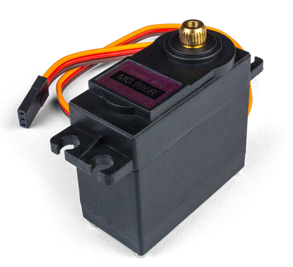

# 藤原麻里菜 無用發明工作坊

2020/10/10

Event info: [無用發明工作坊 by 藤原麻里菜](https://www.accupass.com/event/2009081833421076057545)

:bulb: Please subscribe Marina's channel -- [無駄づくり / MUDAzukuri](https://www.youtube.com/c/mudadukuri) :heart_eyes: :heart_eyes: :heart_eyes:

## About the repo

	.
	|-- README.md
	|-- images
	|   |-- visual.jpg
	|   `-- workshop.jpg
	|-- mydevice
	|   |-- 3dp
	|   |-- code
	|   `-- design
	`-- workshop
	    |-- 1010_Wrokshop_code.pdf
	    |-- Piezo_Test
	    |-- Servo_Button
	    |-- Servo_Photoresistor
	    `-- Servo_Piezo

* [workshop/](workshop) - All the Arduino code we wrote in the workshop.
* [mydevice/](mydevice) - The useless device I made
	* 3dp - 3D print parts
	* code - Arduino code. "MudaDevice" is the final working version
	* design - The wiring diagram draws by Fritzing
	* video - a simple demo video to show how does it work

## The Wiring Diagram

I use a small switch button to switch "Running mode "and "Demo mode". In the Running mode, all behavior trigger by the piezo button. In Demo mode, the arm will move up and move down until switch back to running mode (Yes, I design it for taking photo :satisfied:).

## The Material List

* Controller
	* Arduino UNO or Arduino Nano
* External Power Supply
	* Micro USB Breakout Board
	* MG966R Servo x3
	* Micro usb cable
* Sound
	* DFPlayer Mini MP3 Player Module
	* Micro SD card (format to FAT32)
	* 8Ω Speaker
	* 1KΩ resistor
* Trigger Button
	* Piezo
	* 10KΩ resistor
* Others
	* A small switch button

This is an interesting part. You can get a Piezo bender from a piezoelectric buzzer. 

**In the workshop, Marina provides a way to use Piezo as a button.** :+1: :+1: :+1: You can find the Arduino sample code in [workshop/Piezo_Test/Piezo_Test.ino](workshop/Piezo_Test/Piezo_Test.ino)

**DO NOT** power MG966R by Arduino, it will damage your Arduino. You have to use an external 5V power supply.

MP3 Player Module. Like using a servo motor,  you have to power by external 5V power supply, or you will get noise audio when you play music.

Please purchase a Servo motor that uses metal gears inside.

~ END ~